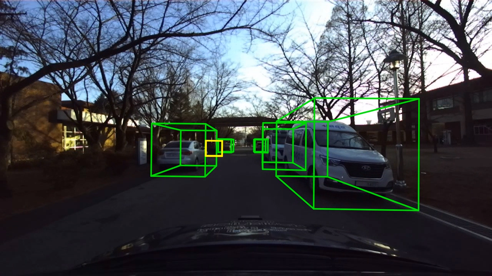
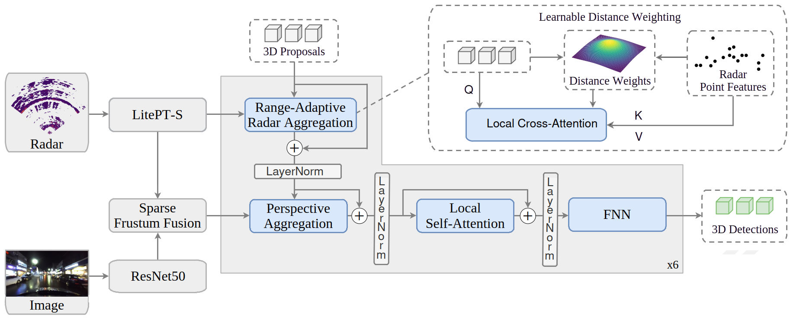

# Radar-Specific Features for Radar-Camera 3D Object Detection in Autonomous Driving
Our method detects 3D objects from radar and camera input using radar-specific feature extraction and sparse frustum fusion to overcome diverse environmental conditions. 

This is the official repository that contains the source code for the work *Radar-Specific Features for Radar-Camera 3D Object Detection in Autonomous Driving*.

[[Project Page](https://ole2412.github.io/radar-camera-fusion/)]

<!--  -->


If you find this research is useful in your research or applications, please consider giving us a star 🌟 and citing it by the following BibTeX entry:

```bibtex
@misc{banning_radar-specific_2026,
    author = {Banning, Ole},
    title  = {Radar-Specific Features for Radar-Camera 3D Object Detection},
    school = {Technical University of Munich},
    year   = {2026},
    type   = {Master's thesis},
    note   = {In preparation},
  }
```